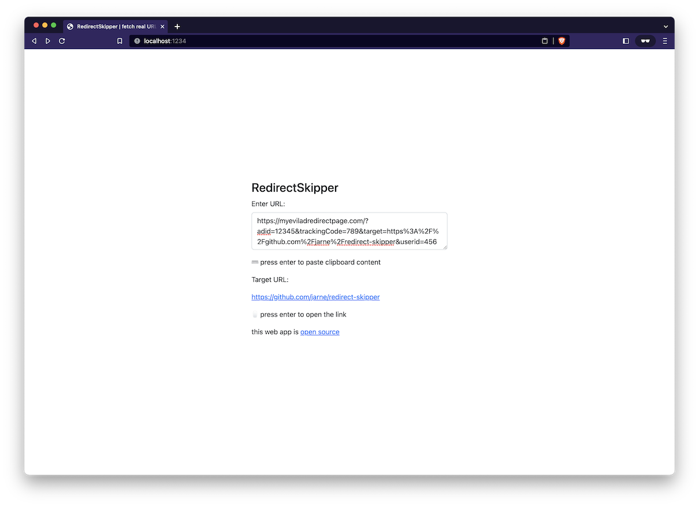

<h1 align="center">Redirect Skipper</h1>
<p align="center">Web tool to fetch real URL out of ad redirects</p>

<br>

<p align="center">
    <a href="https://github.com/jarne/redirect-skipper/blob/master/package.json">
        
    </a>
    <a href="https://app.netlify.com/sites/incomparable-bombolone-6394dd/deploys">
        
    </a>
    <a href="https://github.com/jarne/redirect-skipper/blob/master/LICENSE">
        
    </a>
</p>

##

[• Description](#-description)  
[• Usage](#-usage)  
[• Contribution](#-contribution)  
[• License](#%EF%B8%8F-license)

## 📙 Description

Many shopping platforms on the internet send you to URL's through ad domains redirecting to the real target URL.
If using an DNS-based ad blocker, you can't open those URL's.
Luckily, most of those ad URL's contain the real destination URL in the URL parameters.
This web app finds encoded URL's in the parameters and redirects you to the real destination.

Here's a screenshot of the web app:



## 🖥 Usage

### Simply way (hosted version)

Use the hosted version at [redirect-skipper.landway.space](https://redirect-skipper.landway.space).

### Self-install (local)

Clone the repository and install the dependencies using:

```
$ yarn install
```

Then run this command to build the web app:

```
$ yarn build
```

The built website will be available in the `dist`-folder, just open the `index.html`-file in your browser or upload the files to a web server.

## 🙋‍ Contribution

Contributions are always very welcome! It's completely equally if you're a beginner or a more experienced developer.

Thanks for your interest 🎉👍!

## 👨‍⚖️ License

[MIT](https://github.com/jarne/redirect-skipper/blob/main/LICENSE)
